# Hotel Booking System
This project is a full-stack hotel booking system designed to streamline reservation management for both users and administrators. 

It focuses on building a dynamic booking experience using Laravel with Vue and Inertia, while handling real-world features such as authentication, filtering, reporting, and email notifications.

## Original Repository

This project is based on a collaborative repository developed during [Laracamp Myanmar 2023](https://github.com/lara-camp), where our team was awarded **3rd place**.

- 🔗 Original Repository: https://github.com/lara-camp/hotel-booking

This fork is maintained to highlight my individual contributions and provide a structured project overview.

## Tech Stack

- **Frontend**: Vue.js, Inertia.js
- **Backend**: Laravel
- **Database**: MySQL

# Features
- CRUD for reservations, rooms and room types
- Easy Reservation
- Authentication and Authorization
- Data Reporting for Admin
- Profile Update
- Reservations and Rooms Filter
- Mail Notification upon complete reservation
- Database caching

## System Architecture
The system uses Laravel as the backend framework with Vue and Inertia for frontend rendering.

- Laravel handles routing, business logic, and database interactions
- Inertia.js enables seamless SPA-like experience without full API separation
- Vue manages interactive UI components

## My Contribution

- **Booking Logic & Availability**
  - Designed and implemented backend logic to determine room availability based on selected dates
  - Handled overlapping reservations and ensured accurate booking validation

- **Database Design**
  - Contributed to brainstorming and structuring the relational database schema
  - Defined relationships between reservations, rooms, room types, and users

- **Performance Optimization**
  - Implemented database caching to improve performance for frequently accessed data

- **User System**
  - Built user registration and profile management features
  - Implemented authentication workflows

- **Notifications**
  - Integrated email notifications for successful reservations using SMTP

- **General Backend Development**
  - Worked on core business logic for reservation workflows and system operations

## Key Learnings
- Learned integration of Laravel with Vue using Inertia.js
- Improved understanding of full-stack application flow
- Gained experience handling booking logic and user workflows
- Implemented email notification systems

## Demo Video

[Watch Demo video on Youtube](https://youtu.be/f-9v1YCCgWc)

## Screenshots
### Login Page
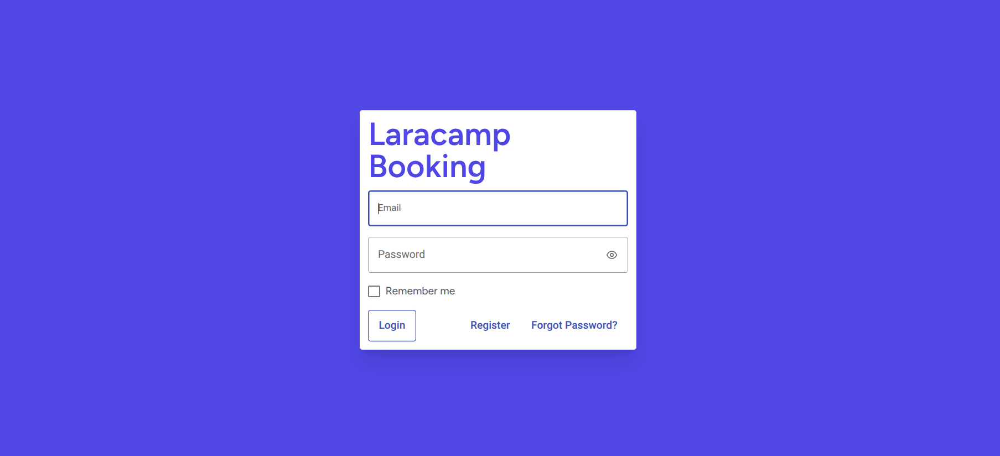

### Register Page
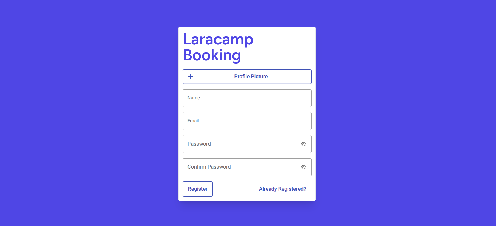

### Home Page
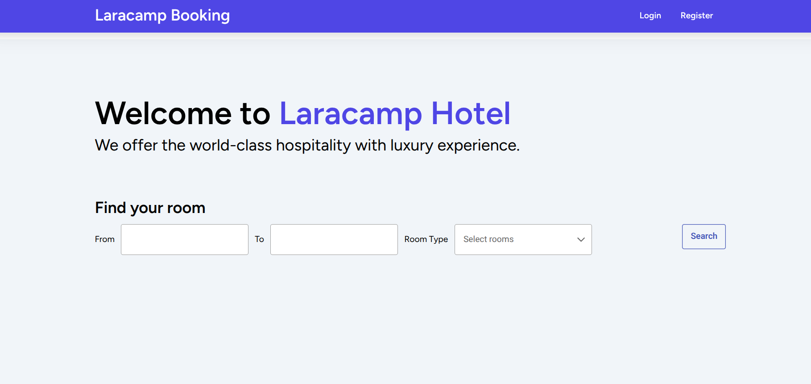

### Available Room
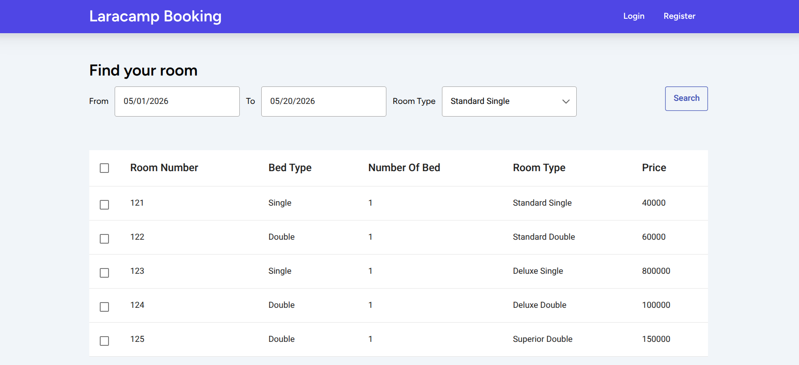

### User Reserve Room
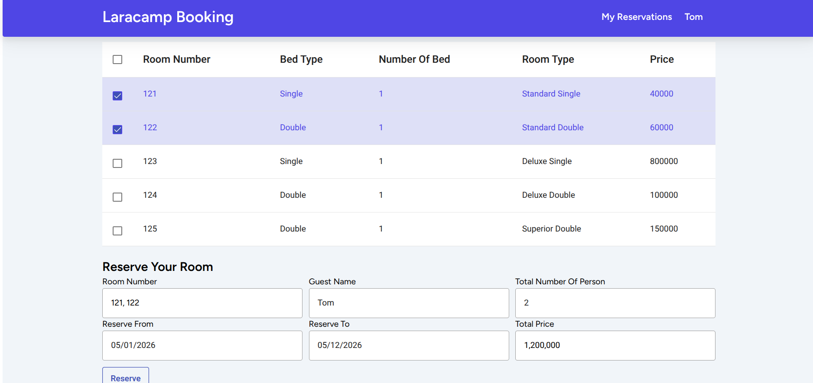
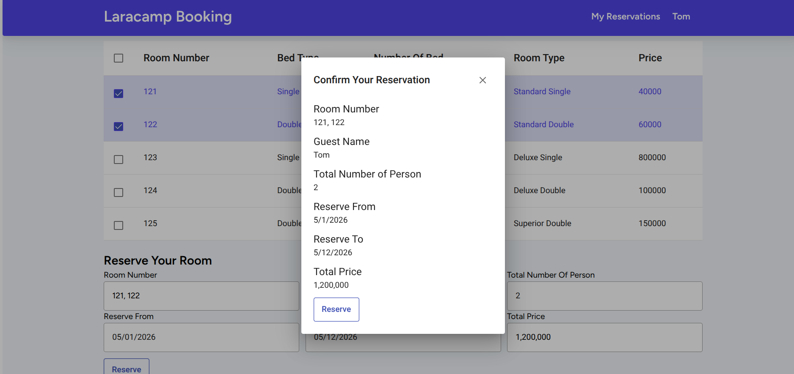

### My Reservations Page
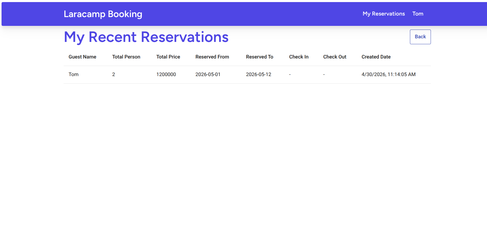

### Admin Dashboard
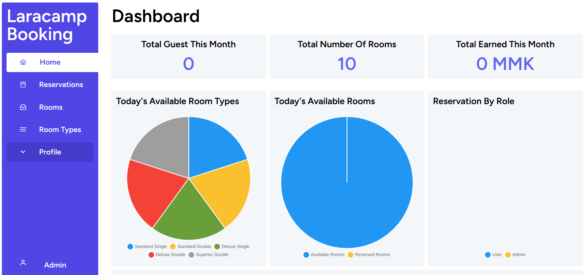

### Admin Profile
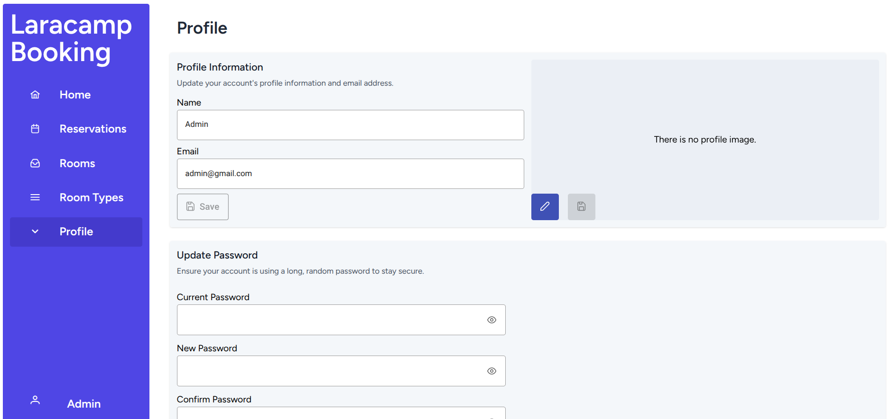

### Dashboard Reservations List
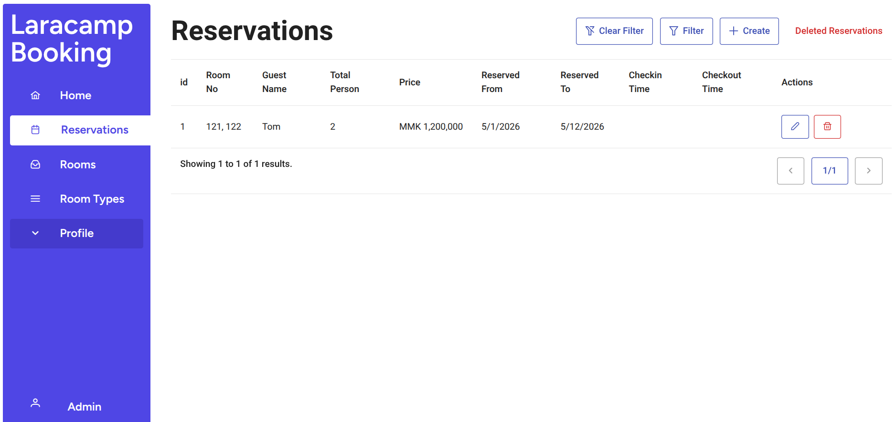

### Admin Room List
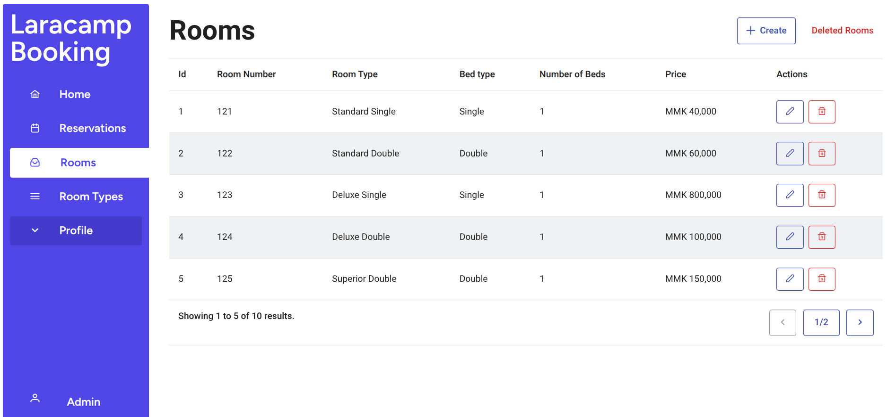

### Admin Room Create Page
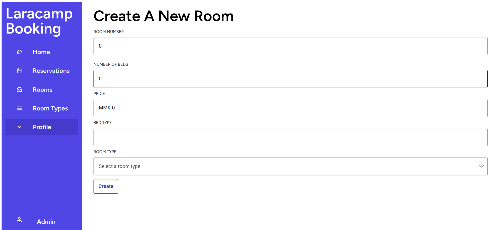

### Admin Room Types
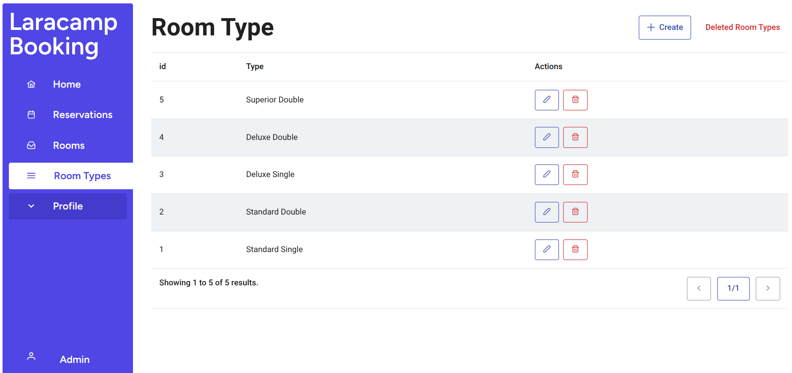

# Project Setup
Download the repository or copy the repository link and run the command below.
```
git clone https://github.com/lara-camp/hotel-booking.git
```

Go to the project directory and install the necessary packages.
```
cd hotel-booking
npm install
composer install
```

After the packages are installed, create a .env file and edit as needed.
```
cp .env.example .env
```
Please don't forget to add mailing address to .env file.
If you don't have one, setup as below.
``` env
MAIL_MAILER=smtp
MAIL_HOST=smtp.gmail.com
MAIL_PORT=465
MAIL_USERNAME=your_email@example.com
MAIL_PASSWORD=your_app_password
MAIL_ENCRYPTION=ssl
MAIL_FROM_ADDRESS="hotelbookgin@laracamp.com"
MAIL_FROM_NAME="${APP_NAME}"
```

Generate the key for the project first. Then, create the database for the project and run the migrations.
```
php artisan key:generate
php artisan migrate
```
Migrate and seed the database
```
php artisan migrate:fresh --seed
```
### Login Using the credentials
Admin
```
Email: admin@gmail.com
Password: password
```
User
```
Email: tom@gmail.com
Password: password
```

## Future Improvements
- Add payment gateway integration
- Improve booking availability algorithm
- Add cancellation and refund system
- Enhance UI/UX for mobile devices